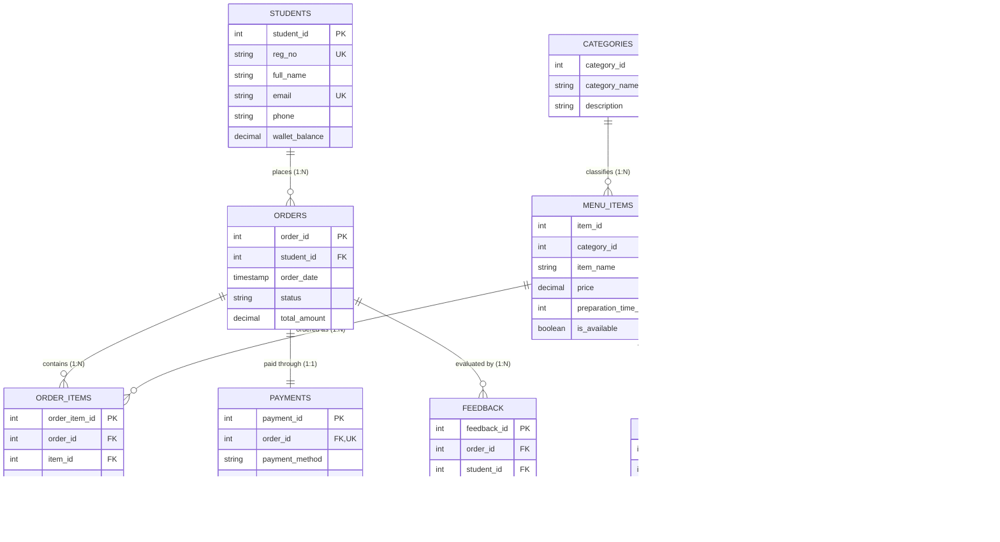

# 🍽️ Smart Canteen Management System
## CSE3001: Database Management Systems — Project & Lab Report
**Course:** CSE3001 — Database Management Systems  
**Domain:** Canteen & Food-Court Operations, Automated Inventory & ACID Transaction Processing  
**Database Engine:** MySQL 8.0+ (InnoDB Storage Engine)

---

## 1. Executive Summary & Problem Definition

Traditional campus canteens suffer from lengthy physical queues, manual paper tokens, inaccurate inventory forecasting, and stock run-outs mid-service. 

The **Smart Canteen Management System** is a computerized relational database solution that automates the lifecycle of canteen operations:
1. **Student Self-Service**: Live digital menu, dynamic bill calculation, instant payment recording, real-time order tracking, and feedback collection.
2. **Kitchen Order Workflow**: Live operational queue transitioning orders seamlessly through `Placed` $\to$ `Preparing` $\to$ `Ready` $\to$ `Picked Up`.
3. **Smart Recipe Inventory (Bill of Materials - BOM)**: Automatic background deduction of raw ingredients (e.g., batter, potatoes, oil) upon order placement via MySQL database triggers.
4. **ACID Transaction Integrity**: Strict database-level transaction control guaranteeing atomicity—if raw ingredients run out or payment fails, MySQL aborts and executes an automatic `ROLLBACK`, eliminating orphan orders and inconsistent financial states.
5. **Business Intelligence & Analytics**: Live views and analytical queries highlighting peak rush hours, top-selling delicacies, ingredient stock deficit levels, and revenue breakdowns.

---

## 2. Mapping to CSE3001 Syllabus (Units 1 to 5)

| Unit | Syllabus Core Topic | Project Implementation & Proof |
| :--- | :--- | :--- |
| **Unit 1** | **ER/EER Modeling & Relational Constraints** | • Conceptual and Relational ER diagrams.<br>• Entity sets, attributes (key, composite, multivalued, derived).<br>• Integrity Constraints: Primary Keys, Foreign Keys (`ON DELETE CASCADE` / `RESTRICT`), `CHECK` constraints (`rating BETWEEN 1 AND 5`, `current_stock >= 0`, `price > 0`), `UNIQUE` constraints (`reg_no`, `transaction_ref`). |
| **Unit 2** | **Relational Algebra & SQL (DDL, DML, Queries, Views)** | • Complete DDL/DML scripts (`01_schema.sql`, `02_seed_data.sql`).<br>• Complex Multi-Table JOINs, Subqueries, `GROUP BY`, `HAVING`, and Aggregate Functions (`SUM`, `AVG`, `COUNT`).<br>• Window functions: `DENSE_RANK()` for student loyalty, `OVER ()` for percentage shares.<br>• 4 Dedicated Views (`vw_live_menu`, `vw_kitchen_queue`, `vw_low_stock_alerts`, `vw_daily_sales_summary`). |
| **Unit 3** | **Relational Database Design & Normalization** | • Functional Dependency (FD) analysis.<br>• Rigorous mathematical proof from Unnormalized Form $\to$ **1NF $\to$ 2NF $\to$ 3NF $\to$ BCNF**.<br>• Proof of Lossless-Join Decomposition and Dependency Preservation. |
| **Unit 4** | **Advanced SQL (Triggers, Procedures, Functions, Indexes)** | • **Triggers**: `trg_check_and_deduct_stock` (Automatic BOM ingredient deduction and stock limit checks), `trg_audit_price_change` (Audits menu price modifications).<br>• **Stored Procedures**: `sp_place_order_json`, `sp_update_order_status`, `sp_restock_ingredient`.<br>• **Stored Functions**: `fn_calculate_bill`, `fn_is_item_available`.<br>• **B-Tree Indexes**: Created on query hot-paths (`order_date`, `status`, `student_id`, `item_id`, `current_stock`). |
| **Unit 5** | **Transaction Processing & Concurrency Control** | • Demonstration of **ACID Properties**.<br>• Explicit `START TRANSACTION`, `COMMIT`, `ROLLBACK`, and `SAVEPOINT` scripts.<br>• Out-of-Stock Failure Rollback simulation demonstrating strict Atomicity. |

---

## 3. Conceptual Model: Entity-Relationship (ER) Diagram



---

## 4. Relational Data Model & Schema Dictionary

### 4.1 Table: `students`
| Attribute | Data Type | Constraints | Description |
| :--- | :--- | :--- | :--- |
| `student_id` | INT | PRIMARY KEY, AUTO_INCREMENT | Unique internal student identifier |
| `reg_no` | VARCHAR(20) | NOT NULL, UNIQUE | University registration number (e.g., 23BCE1001) |
| `full_name` | VARCHAR(100) | NOT NULL | Full name of the student |
| `email` | VARCHAR(100) | NOT NULL, UNIQUE | Official email address |
| `phone` | VARCHAR(15) | NOT NULL | Contact telephone number |
| `wallet_balance` | DECIMAL(10,2) | NOT NULL, DEFAULT 500.00, CHECK (>= 0) | Digital campus canteen wallet balance |

### 4.2 Table: `menu_items`
| Attribute | Data Type | Constraints | Description |
| :--- | :--- | :--- | :--- |
| `item_id` | INT | PRIMARY KEY, AUTO_INCREMENT | Unique dish identifier |
| `category_id` | INT | NOT NULL, FOREIGN KEY $\to$ `categories(category_id)` | Category reference |
| `item_name` | VARCHAR(100) | NOT NULL, UNIQUE | Name of delicacy |
| `price` | DECIMAL(8,2) | NOT NULL, CHECK (> 0) | Unit retail price in INR |
| `preparation_time_mins`| INT | DEFAULT 10, CHECK (>= 0) | Standard kitchen turnaround time |
| `is_available` | BOOLEAN | NOT NULL, DEFAULT TRUE | Manual canteen availability toggle |

### 4.3 Table: `ingredients`
| Attribute | Data Type | Constraints | Description |
| :--- | :--- | :--- | :--- |
| `ingredient_id` | INT | PRIMARY KEY, AUTO_INCREMENT | Unique raw material identifier |
| `ingredient_name` | VARCHAR(100) | NOT NULL, UNIQUE | Name of raw material (e.g., Dosa Batter) |
| `unit` | VARCHAR(20) | NOT NULL | Measurement unit ('grams', 'ml', 'pieces') |
| `current_stock` | DECIMAL(10,2) | NOT NULL, CHECK (>= 0) | Real-time available physical stock |
| `min_threshold` | DECIMAL(10,2) | NOT NULL, CHECK (>= 0) | Reorder level triggering low-stock alerts |
| `cost_per_unit` | DECIMAL(8,2) | NOT NULL, DEFAULT 0.00 | Procurement cost per unit |

### 4.4 Table: `item_ingredients` (Recipe Bill of Materials)
| Attribute | Data Type | Constraints | Description |
| :--- | :--- | :--- | :--- |
| `item_id` | INT | COMPOSITE PK, FK $\to$ `menu_items(item_id)` | Menu dish |
| `ingredient_id` | INT | COMPOSITE PK, FK $\to$ `ingredients(ingredient_id)` | Raw ingredient required |
| `quantity_required` | DECIMAL(8,2) | NOT NULL, CHECK (> 0) | Quantity needed per single unit of dish |

### 4.5 Table: `orders`
| Attribute | Data Type | Constraints | Description |
| :--- | :--- | :--- | :--- |
| `order_id` | INT | PRIMARY KEY, AUTO_INCREMENT | Unique order token |
| `student_id` | INT | NOT NULL, FK $\to$ `students(student_id)` | Ordering customer |
| `order_date` | TIMESTAMP | DEFAULT CURRENT_TIMESTAMP | Date & timestamp of placement |
| `status` | ENUM | NOT NULL, DEFAULT 'Placed' | 'Placed', 'Preparing', 'Ready', 'Picked Up', 'Cancelled' |
| `total_amount` | DECIMAL(10,2) | NOT NULL, CHECK (>= 0) | Aggregated payable order amount |

---

## 5. Unit 3: Normalization Proof (1NF $\to$ 2NF $\to$ 3NF $\to$ BCNF)

### 5.1 The Unnormalized Relation (UNF)
Consider an unnormalized operational register storing canteen transactions:
```
CANTEEN_LOG (
    student_id, reg_no, student_name, student_email,
    order_id, order_date, status,
    item_id, item_name, category_id, category_name, item_price,
    quantity, subtotal,
    ingredient_id, ingredient_name, unit, current_stock, qty_required,
    payment_id, payment_method, transaction_ref,
    rating, comments
)
```

### 5.2 First Normal Form (1NF)
**Definition**: A relation is in 1NF if and only if all attribute domains contain only atomic (indivisible) values, and there are no repeating groups.
- In UNF, each order contains a repeating group of items and ingredients.
- **Resolution**: We identify the composite primary key `(order_id, item_id, ingredient_id)` and flatten all repeating structures into atomic entries.

### 5.3 Second Normal Form (2NF)
**Definition**: A relation is in 2NF if it is in 1NF and every non-prime attribute is fully functionally dependent on the entire primary key (no partial dependencies).
- **Identified Partial Dependencies on Candidate Key `(order_id, item_id, ingredient_id)`**:
  - `order_id` $\to$ `student_id, order_date, status` (Depends only on `order_id`)
  - `student_id` $\to$ `reg_no, student_name, student_email` (Depends only on student)
  - `item_id` $\to$ `item_name, category_id, item_price` (Depends only on `item_id`)
  - `ingredient_id` $\to$ `ingredient_name, unit, current_stock` (Depends only on `ingredient_id`)
  - `(item_id, ingredient_id)` $\to$ `qty_required` (Depends only on item recipe)
  - `(order_id, item_id)` $\to$ `quantity, subtotal`
- **Resolution**: We decompose the schema into separate relations:
  - `ORDERS`, `STUDENTS`, `MENU_ITEMS`, `INGREDIENTS`, `ITEM_INGREDIENTS`, and `ORDER_ITEMS`. Now, all non-key attributes depend on the full primary key of their respective tables.

### 5.4 Third Normal Form (3NF)
**Definition**: A relation is in 3NF if it is in 2NF and no non-prime attribute is transitively dependent on the primary key ($X \to Y$ where $Y \to Z$ and $X \to Z$).
- In `MENU_ITEMS`, we had:
  - `item_id` $\to$ `category_id` $\to$ `category_name` (Transitive Dependency)
- **Resolution**: Decompose into:
  - `MENU_ITEMS (item_id, category_id, item_name, price, ...)`
  - `CATEGORIES (category_id, category_name, description)`
- Similarly, payments and feedback are isolated with their respective candidate keys.

### 5.5 Boyce-Codd Normal Form (BCNF)
**Definition**: A relation is in BCNF if for every functional dependency $X \to Y$, $X$ is a superkey.
- In all decomposed tables (`students`, `categories`, `menu_items`, `ingredients`, `item_ingredients`, `orders`, `order_items`, `payments`, `feedback`), every left-hand side determinant ($X$) is either the Primary Key or a declared Candidate Key (`UNIQUE`).
- **Conclusion**: The schema is in **BCNF**, completely free of update, insertion, and deletion anomalies, with **Lossless Join** and **Dependency Preservation** guaranteed.

---

## 6. Unit 4: Triggers, Stored Procedures & Indexing

### 6.1 Automatic Inventory Deduction Trigger (`trg_check_and_deduct_stock`)
- When an order item is recorded (`AFTER INSERT ON order_items`), MySQL initiates a cursor traversing `item_ingredients`.
- For each ingredient, it multiplies `quantity_required` by ordered `quantity`.
- If `current_stock < needed`, the trigger fires `SIGNAL SQLSTATE '45000'`, intentionally throwing an unhandled exception to force a transaction rollback.
- If sufficient, it deducts stock and records an entry into `inventory_logs`.

### 6.2 Price Change Audit Trigger (`trg_audit_price_change`)
- Fires `BEFORE UPDATE ON menu_items`.
- Whenever `OLD.price <> NEW.price`, it automatically writes the item ID, old price, new price, username, and timestamp into `price_audit_log`.

### 6.3 Stored Procedure: Atomic JSON Order (`sp_place_order_json`)
- Accepts a student ID, payment method, instructions, and a JSON array of items.
- Manages an explicit `START TRANSACTION ... COMMIT` boundary.
- Uses `DECLARE EXIT HANDLER FOR SQLEXCEPTION` to guarantee `ROLLBACK` on any constraint violation.

---

## 7. Unit 5: Transactions, ACID Properties & Concurrency

### 7.1 Demonstration of ACID Properties
- **Atomicity**: Either the order, all order items, inventory reductions, and payment are all committed together, or none of them are.
- **Consistency**: Invariants (e.g. `current_stock >= 0`, `wallet_balance >= 0`, and foreign key references) are enforced continuously.
- **Isolation**: InnoDB uses Multi-Version Concurrency Control (MVCC) and row-level locking to ensure concurrent orders do not cause race conditions on stock.
- **Durability**: Once `COMMIT` executes, all transactional changes are written to the Write-Ahead Log (WAL / redo log) and survive system crashes.

### 7.2 The Failure & Rollback Scenario
```sql
START TRANSACTION;
-- 1. Insert order for 500 burgers (exceeds inventory)
-- 2. Trigger signals SQLSTATE '45000' (Out of stock)
-- 3. Exception caught -> ROLLBACK;
-- 4. Result: Zero records inserted into orders, payments, or order_items.
```
